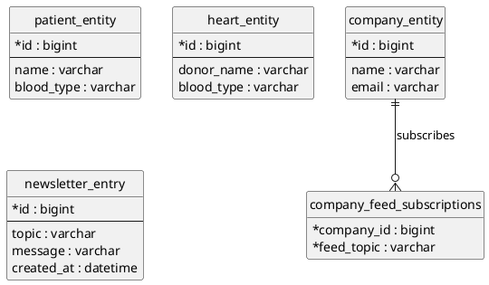

# Projekt Dokumentation

Diese Datei ist als Markdown-Quelle für eine spätere PDF-Aufbereitung gedacht.

## Überblick

Dieses Projekt ist eine Spring-Boot-Anwendung mit Thymeleaf-Frontend und JPA-basierter Persistenz auf MariaDB. Inhaltlich dreht sich die Anwendung um eine einfache Matching- und Benachrichtigungslogik für Patienten und Spenderherzen sowie um einen Newsletter-Feed für Firmen, die Benachrichtigungen nach Themen abonnieren können.

Beim Start werden über einen `CommandLineRunner` Beispiel-Daten angelegt, falls die Datenbank leer ist. Danach stellt die Anwendung mehrere Web-Oberflächen bereit, über die Patienten, Herzen und Firmen verwaltet werden können.

Die Doku ist bewusst so geschrieben, dass sie später leicht in eine abgabereife PDF überführt werden kann.

Die Webanwendung nutzt Server-Side Rendering: Die HTML-Seiten werden auf dem Server mit Thymeleaf erzeugt und anschließend an den Browser ausgeliefert. Es gibt also kein separates Frontend in JavaScript, sondern die Views entstehen direkt aus den Daten, die der Server in das Modell legt.

## Verwendete Technologien

- Java 17
- Spring Boot 3.1.5
- Spring Web
- Spring Data JPA
- Thymeleaf
- MariaDB

Die Datenbankverbindung ist in [application.properties](src/main/resources/application.properties) konfiguriert. Dort ist auch der Hinweis enthalten, dass MariaDB lokal verfügbar sein muss und die Datenbank `demo` sowie ein passender Benutzer angelegt sein müssen.

## Projektaufbau

Die wichtigsten Komponenten sind:

- MVC als Grundstruktur der Webanwendung:
  - Model: JPA-Entitäten, Domänenobjekte und Repositories
  - View: Thymeleaf-Templates im Ordner `src/main/resources/templates`
  - Controller: Klassen im Paket `endpoints`, die Requests annehmen und Daten an die Views liefern
- `Main`: Startpunkt der Anwendung und Seed für Beispieldaten
- `database`: JPA-Entitäten für Patienten, Herzen und Firmen
- `endpoints`: MVC-Controller für die Weboberfläche
- `matcher`: Fachlogik zur Blutgruppen-Kompatibilität
- `model`: Repositories und Domänenmodelle für Matching und Persistenz
- `notification`: Event-Modell, Newsletter-Einträge und Listener
- `service`: Fachservice für Kandidaten-Benachrichtigungen

## Komponenten und Zusammenarbeit

### Start und Initialisierung

Die Anwendung startet in [Main.java](src/main/java/com/example/Main.java). Beim Start werden, falls noch keine Daten vorhanden sind, Testdaten für Patienten und Herzen gespeichert. Das sorgt dafür, dass die Oberfläche direkt mit Inhalt verfügbar ist.

Die Controller rendern ihre Inhalte serverseitig, indem sie Daten in ein `Model` schreiben und dann einen View-Namen wie `patients`, `hearts`, `companies`, `newsletter` oder `dashboard` zurückgeben. Thymeleaf verarbeitet diesen View-Namen zusammen mit den Modellwerten zu einer fertigen HTML-Seite.

### Patienten und Herzen

Patienten werden über [PatientController.java](src/main/java/com/example/endpoints/PatientController.java) verwaltet, Herzen über [HeartController.java](src/main/java/com/example/endpoints/HeartController.java). Beide Controller speichern Eingaben über ihre jeweiligen Repositories in der Datenbank.

Nach dem Speichern wird jeweils ein Feed-Event erzeugt:

- `NEW_PATIENT` bei neuen Patienten
- `NEW_HEART` bei neuen Herzen

Zusätzlich ruft beide Controller den [CandidateNotificationService.java](src/main/java/com/example/service/CandidateNotificationService.java) auf. Dieser vergleicht die neu gespeicherte Entität mit allen vorhandenen Gegenstücken und veröffentlicht bei einem Treffer einen Event vom Typ `NEW_CANDIDATE`.

### Matching-Logik

Die eigentliche Kompatibilitätsprüfung liegt in [KomplexMatcher.java](src/main/java/com/example/matcher/KomplexMatcher.java). Dort wird geprüft, ob Blutgruppen zueinander passen. Unterstützt werden:

- exakte Übereinstimmung
- ABO-Kompatibilität
- Rh-Faktor-Regeln

Der Matcher arbeitet mit den vereinfachten Domänenobjekten `Patient` und `Heart`, nicht direkt mit den JPA-Entitäten. Deshalb werden die Entity-Daten vor dem Vergleich in diese Domänenobjekte umgewandelt.

### Newsletter und Feed

Der Newsletter-Feed wird über [NewsletterController.java](src/main/java/com/example/endpoints/NewsletterController.java) angezeigt. Dort können Einträge nach Thema und optional nach Firma gefiltert werden.

Neue Feed-Einträge entstehen nicht direkt im Controller, sondern über das Event-System:

1. Ein Controller oder Service erzeugt ein [FeedNotificationEvent](src/main/java/com/example/notification/FeedNotificationEvent.java).
2. [NewsletterFeedListener.java](src/main/java/com/example/notification/NewsletterFeedListener.java) reagiert auf das Event.
3. Der Listener speichert daraus einen [NewsletterEntry](src/main/java/com/example/notification/NewsletterEntry.java) im [NewsletterRepository](src/main/java/com/example/notification/NewsletterRepository.java).

So bleibt die Feed-Erzeugung entkoppelt von der Persistenz der Newsletter-Einträge.

### Firmen und Subscriptions

Firmen werden über [CompanyController.java](src/main/java/com/example/endpoints/CompanyController.java) verwaltet. Firmen können Feed-Themen abonnieren oder abbestellen. Die Abonnements werden direkt als Menge von [FeedTopic](src/main/java/com/example/enums/FeedTopic.java)-Werten in der [CompanyEntity](src/main/java/com/example/database/CompanyEntity.java) gespeichert.

Der Newsletter-Controller nutzt diese Abonnements beim Filtern: Wenn eine Firma ausgewählt ist, werden nur die Newsletter-Einträge angezeigt, deren Topic in den Abonnements der Firma enthalten ist.

### Dashboard

Der [DashboardController.java](src/main/java/com/example/endpoints/DashboardController.java) dient als Übersicht. Er lädt alle Patienten und Herzen, zählt die vorhandenen Datensätze und bestimmt zusätzlich die Anzahl möglicher Kandidaten über den Matcher.

## Datenmodell

- [PatientEntity.java](src/main/java/com/example/database/PatientEntity.java): Patient mit Name und Blutgruppe
- [HeartEntity.java](src/main/java/com/example/database/HeartEntity.java): Spenderherz mit Spendername und Blutgruppe
- [CompanyEntity.java](src/main/java/com/example/database/CompanyEntity.java): Firma mit E-Mail und abonnierten Feed-Themen
- [NewsletterEntry.java](src/main/java/com/example/notification/NewsletterEntry.java): Feed-Eintrag mit Thema, Nachricht und Zeitstempel

## PlantUML

### Architektur- und Ablaufdiagramm

```plantuml
@startuml
skinparam classAttributeIconSize 0
skinparam packageStyle rectangle
skinparam shadowing false

package "Presentation / Web" {
  class HomeController {
    +home() : RedirectView
  }

  class DashboardController {
    -patientRepository : PatientRepository
    -heartRepository : HeartRepository
    +DashboardController(patientRepository, heartRepository)
    +dashboard(model : Model) : String
  }

  class PatientController {
    -patientRepository : PatientRepository
    -eventPublisher : ApplicationEventPublisher
    -candidateNotificationService : CandidateNotificationService
    +PatientController(patientRepository, eventPublisher, candidateNotificationService)
    +list(model : Model) : String
    +create(patient : PatientEntity) : String
  }

  class HeartController {
    -heartRepository : HeartRepository
    -eventPublisher : ApplicationEventPublisher
    -candidateNotificationService : CandidateNotificationService
    +HeartController(heartRepository, eventPublisher, candidateNotificationService)
    +list(model : Model) : String
    +create(heart : HeartEntity) : String
  }

  class CompanyController {
    -companyRepository : CompanyRepository
    +CompanyController(companyRepository)
    +list(model : Model) : String
    +create(company : CompanyEntity) : String
    +subscribe(companyId : Long, topic : FeedTopic) : String
    +unsubscribe(companyId : Long, topic : FeedTopic) : String
  }

  class NewsletterController {
    -newsletterRepository : NewsletterRepository
    -companyRepository : CompanyRepository
    +NewsletterController(newsletterRepository, companyRepository)
    +feed(topic : FeedTopic, companyId : Long, model : Model) : String
  }
}

package "Application Services" {
  class CandidateNotificationService {
    -heartRepository : HeartRepository
    -patientRepository : PatientRepository
    -eventPublisher : ApplicationEventPublisher
    +CandidateNotificationService(heartRepository, patientRepository, eventPublisher)
    +notifyForPatient(savedPatient : PatientEntity) : void
    +notifyForHeart(savedHeart : HeartEntity) : void
    -publishCandidateMessage(patientName : String, patientBloodType : String, donorName : String, donorBloodType : String) : void
    -safeValue(value : String, fallback : String) : String
  }

  class KomplexMatcher {
    +match(patient : Patient, heart : Heart) : boolean
  }

  class NewsletterFeedListener {
    -newsletterRepository : NewsletterRepository
    +NewsletterFeedListener(newsletterRepository)
    +handleFeedNotification(event : FeedNotificationEvent) : void
  }
}

package "Persistence" {
  interface PatientRepository
  interface HeartRepository
  interface CompanyRepository
  interface NewsletterRepository
}

package "Domain Model" {
  class PatientEntity {
    -id : Long
    -name : String
    -bloodType : String
    +PatientEntity()
    +PatientEntity(name : String, bloodType : String)
    +getId() : Long
    +getName() : String
    +setName(name : String) : void
    +getBloodType() : String
    +setBloodType(bloodType : String) : void
  }

  class HeartEntity {
    -id : Long
    -donorName : String
    -bloodType : String
    +HeartEntity()
    +HeartEntity(donorName : String, bloodType : String)
    +getId() : Long
    +getDonorName() : String
    +setDonorName(donorName : String) : void
    +getBloodType() : String
    +setBloodType(bloodType : String) : void
  }

  class CompanyEntity {
    -id : Long
    -name : String
    -email : String
    -subscriptions : Set<FeedTopic>
    +CompanyEntity()
    +CompanyEntity(name : String, email : String)
    +getId() : Long
    +getName() : String
    +setName(name : String) : void
    +getEmail() : String
    +setEmail(email : String) : void
    +getSubscriptions() : Set<FeedTopic>
    +setSubscriptions(subscriptions : Set<FeedTopic>) : void
    +subscribe(topic : FeedTopic) : void
    +unsubscribe(topic : FeedTopic) : void
  }

  class NewsletterEntry {
    -id : Long
    -topic : FeedTopic
    -message : String
    -createdAt : LocalDateTime
    +NewsletterEntry()
    +NewsletterEntry(message : String)
    +NewsletterEntry(topic : FeedTopic, message : String)
    +getId() : Long
    +getTopic() : FeedTopic
    +setTopic(topic : FeedTopic) : void
    +getMessage() : String
    +setMessage(message : String) : void
    +getCreatedAt() : LocalDateTime
    +setCreatedAt(createdAt : LocalDateTime) : void
  }

  class FeedNotificationEvent {
    -topic : FeedTopic
    -message : String
    +FeedNotificationEvent(topic : FeedTopic, message : String)
    +getTopic() : FeedTopic
    +getMessage() : String
  }

  enum FeedTopic {
    GENERAL
    NEW_PATIENT
    NEW_HEART
    NEW_CANDIDATE
    +getLabel() : String
  }

  class Patient {
    -id : String
    -name : String
    -bloodType : String
    +Patient(id : String, name : String, bloodType : String)
    +getId() : String
    +getName() : String
    +getBloodType() : String
    +toString() : String
  }

  class Heart {
    -id : String
    -donorName : String
    -bloodType : String
    +Heart(id : String, donorName : String, bloodType : String)
    +getId() : String
    +getDonorName() : String
    +getBloodType() : String
    +toString() : String
  }

  class Candidate {
    -patient : Patient
    -heart : Heart
    +Candidate(patient : Patient, heart : Heart)
    +getPatient() : Patient
    +getHeart() : Heart
    +toString() : String
  }

  interface Icandidate {
    +getPatient() : Patient
    +getHeart() : Heart
  }

  interface IManager<T> {
    +add(element : T) : void
    +getAllManagedElements() : List<T>
    +addAll(elementList : List<T>) : void
  }

  class Manager<T> {
    -managedList : List<T>
    +Manager()
    +add(element : T) : void
    +addAll(elementList : List<T>) : void
    +getAllManagedElements() : List<T>
  }

  interface IMatcher {
    +match(patient : Patient, heart : Heart) : boolean
  }
}

class Main

Main --> PatientRepository : seed data
Main --> HeartRepository : seed data

HomeController --> PatientController : redirect /
DashboardController --> PatientRepository : load patients
DashboardController --> HeartRepository : load hearts
DashboardController --> KomplexMatcher : count candidates

PatientController --> PatientRepository : save/find
PatientController --> CandidateNotificationService : notifyForPatient()
PatientController --> FeedNotificationEvent : NEW_PATIENT

HeartController --> HeartRepository : save/find
HeartController --> CandidateNotificationService : notifyForHeart()
HeartController --> FeedNotificationEvent : NEW_HEART

CompanyController --> CompanyRepository : save/update
NewsletterController --> NewsletterRepository : read feed
NewsletterController --> CompanyRepository : load subscriptions

CandidateNotificationService --> HeartRepository : compare against hearts
CandidateNotificationService --> PatientRepository : compare against patients
CandidateNotificationService --> KomplexMatcher : evaluate match
CandidateNotificationService --> FeedNotificationEvent : NEW_CANDIDATE

NewsletterFeedListener --> NewsletterRepository : persist entry
NewsletterFeedListener --> NewsletterEntry : create from event

FeedNotificationEvent --> FeedTopic
NewsletterEntry --> FeedTopic

entity "company_subscription_entry" as company_subscription_entry {
  * company_id : bigint
  * feed_topic : varchar
}

CompanyEntity "1" *-- "0..*" company_subscription_entry : subscriptions

CandidateNotificationService ..> Patient : adapt entity
CandidateNotificationService ..> Heart : adapt entity
DashboardController ..> Patient : adapt entity
DashboardController ..> Heart : adapt entity
KomplexMatcher ..> Patient
KomplexMatcher ..> Heart
Candidate --> Patient
Candidate --> Heart
Manager ..|> IManager
KomplexMatcher ..|> IMatcher
Patient ..|> Icandidate
Heart ..|> Icandidate

@enduml
```

### ERD der Datenbank

Die Datenbank besteht im Kern aus vier Fachtabellen. Zusätzlich erzeugt JPA für die `@ElementCollection` der Firmen eine separate Zuordnungstabelle. Diese Tabelle ist also eine echte Zwischentabelle, aber nicht zwischen zwei Fachentitäten, sondern zwischen `company_entity` und den einzelnen `FeedTopic`-Werten.

Konkret bedeutet das:

- `patient_entity` speichert Patienten
- `heart_entity` speichert Spenderherzen
- `company_entity` speichert Firmen
- `newsletter_entry` speichert Feed-Einträge
- `company_feed_subscriptions` speichert die abonnierten Feed-Themen einer Firma

## Ablauf im Überblick

1. Die Anwendung startet und lädt bei leerer Datenbank Beispieldaten.
2. Über die Weboberfläche werden Patienten, Herzen und Firmen gepflegt.
3. Beim Anlegen eines Patienten oder Herzens wird geprüft, ob passende Gegenstücke existieren.
4. Wenn ein Match gefunden wird, entsteht ein Feed-Event mit dem Topic `NEW_CANDIDATE`.
5. Der Newsletter-Listener speichert alle Feed-Events als Newsletter-Einträge.
6. Firmen können Topics abonnieren und im Newsletter nur passende Einträge sehen.

## Hinweise zur Ausführung

- Vor dem Start muss MariaDB laufen.
- Die Datenbank `demo` und der Benutzer aus [application.properties](src/main/resources/application.properties) müssen existieren.
- Das Projekt wird über Spring Boot gestartet, der Einstiegspunkt ist [Main.java](src/main/java/com/example/Main.java).
